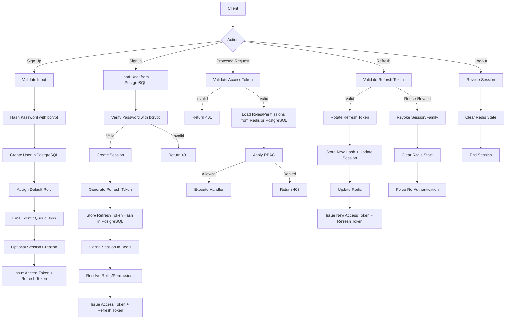
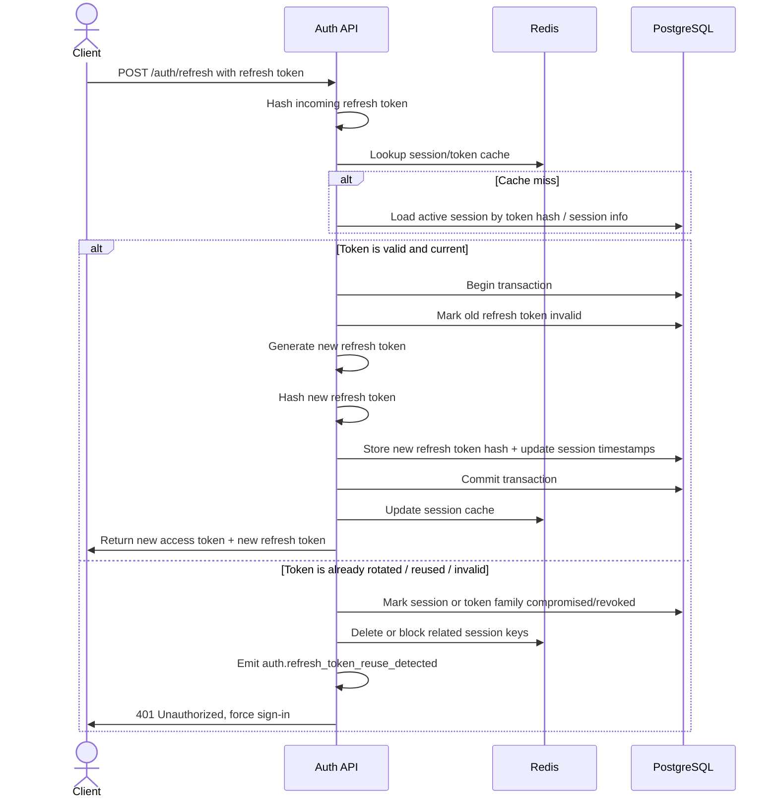
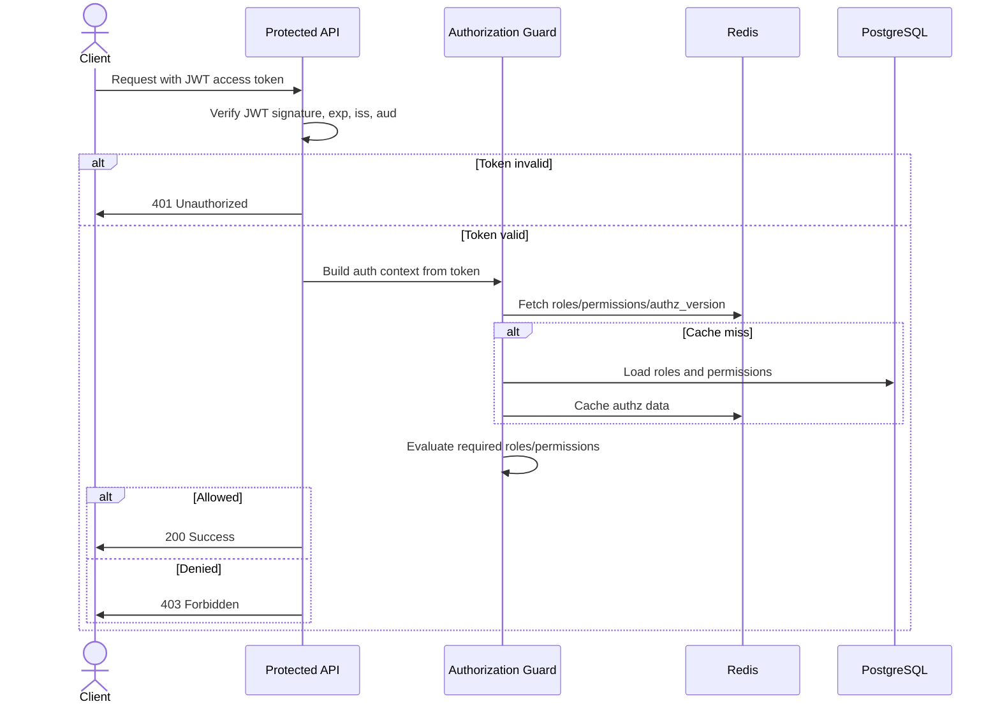

# 007 - JWT Authentication, Authorization, and RBAC with Refresh Token Rotation

- **Date:** 2026-06-06
- **Decision Makers:** Faiyaz Mahmud (Backend Developer)
- **Related ADRs:**
    - [Modular Monolith](001-use-modular-monolith.md)
    - [Postgres](002-use-postgres-as-primary-db.md)
    - [Redis](004-use-redis-for-cache-management.md)
    - [BullMQ](005-use-bullmq-for-event-driven-bg-job-processing.md)
---

## Context

The system is a **modular monolith** using **PostgreSQL**, **Redis**, **BullMQ**, and **event-driven internal communication**. It requires a secure, scalable, and maintainable solution for:

- **Authentication**: sign up, sign in, session management, logout
- **Authorization**: protecting routes and resources
- **RBAC**: assigning roles and enforcing permissions

A purely stateless JWT approach is not sufficient because the system also needs:

- server-side session revocation
- logout from one or all devices
- password-change-based invalidation
- refresh token theft/replay detection
- efficient role/permission enforcement
- immediate or near-immediate authorization cache invalidation

---

## Decision

We will implement:

- **short-lived JWT access tokens** for API authentication
- **refresh token rotation** for session continuation
- **bcrypt** for password hashing
- **RBAC** for authorization
- **PostgreSQL** as the source of truth
- **Redis** for ephemeral auth/session/cache state
- **events + BullMQ** for async side effects such as audit logging and notifications

### Authentication

#### Access Token
- JWT signed by the server
- Sent in `Authorization: Bearer <token>`
- Short TTL: **5-15 minutes**
- Contains:
  - `sub` -> user ID
  - `sid` -> session ID
  - `jti` -> token ID
  - `exp`, `iat`, `iss`, `aud`
  - optional `authz_version`

#### Refresh Token
- Long-lived token used only at the refresh endpoint
- TTL: **7-30 days**
- Stored server-side only as a **hash**
- Rotated on every successful refresh
- Stored client-side securely (preferably **HttpOnly Secure SameSite cookie** for web apps)

### Password Hashing
- Passwords will be hashed using **bcrypt**
- Plaintext passwords will never be stored
- Password verification will use secure compare functions
- Password change/reset will revoke all active sessions

### Session Persistence
PostgreSQL will store session records such as:

- `id`
- `user_id`
- `token_family_id`
- `refresh_token_hash`
- `status`
- `created_at`
- `expires_at`
- `last_used_at`
- `revoked_at`

### Refresh Token Rotation
On each refresh request:

1. validate the incoming refresh token
2. verify it matches the current active session token
3. invalidate the old refresh token
4. generate a new refresh token
5. store the new refresh token hash
6. issue a new access token and new refresh token

If an already-used refresh token is presented again:

- treat it as **token reuse/replay**
- revoke the session or token family
- clear related Redis state
- require full re-authentication
- emit a security event

### Authorization and RBAC

#### RBAC Model
Use the following logical model:

- `users`
- `roles`
- `permissions`
- `user_roles`
- `role_permissions`

#### Enforcement
For protected requests:

1. validate JWT access token
2. extract user identity and session context
3. load roles/permissions from Redis or PostgreSQL
4. evaluate required role(s) or permission(s)
5. allow or deny request

Responses:
- invalid/expired token -> `401 Unauthorized`
- authenticated but insufficient permission -> `403 Forbidden`

### Redis Usage

Redis will be used for:

- **session cache**
- **refresh/session lookup acceleration**
- **revocation markers**
- **RBAC/permission cache**
- **rate limiting** on login/refresh/reset endpoints
- **cache invalidation support** when roles, permissions, or passwords change

Redis is **not** the source of truth. PostgreSQL remains authoritative.

### High-Level Flow

#### Sign Up
1. Validate input
2. Hash password with bcrypt
3. Create user in PostgreSQL
4. Assign default role(s)
5. Emit `auth.user_registered`
6. Queue async jobs (welcome email, verification, audit)
7. Optionally create session and issue tokens

#### Sign In
1. Find user in PostgreSQL
2. Verify password with bcrypt
3. Create session record
4. Generate refresh token and store its hash
5. Cache session metadata in Redis
6. Resolve roles/permissions
7. Issue access token and refresh token
8. Emit `auth.user_signed_in`

#### Access Token Usage
1. Client calls protected API with access token
2. Validate JWT
3. Resolve roles/permissions from Redis or PostgreSQL
4. Apply RBAC guard
5. Allow or deny request

#### Refresh Token Rotation
1. Client sends refresh token
2. Hash and validate it
3. Confirm session is active and token is current
4. Invalidate old refresh token
5. Store new refresh token hash
6. Issue new access token and refresh token
7. Update Redis session state

#### Logout
1. Revoke current session in PostgreSQL
2. Remove/update Redis session state
3. Invalidate refresh capability
4. Optionally revoke all sessions

#### Role/Permission Change
1. Update role/permission data in PostgreSQL
2. Invalidate Redis authz cache
3. Emit authz update event
4. Enforce change on next request, next refresh, or immediately via session revocation depending on policy

### Flow Diagram

#### Refresh Token Rotation and Reuse Detection Sequence

#### Authorization and RBAC Sequence
