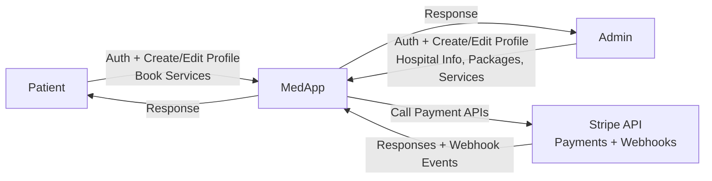
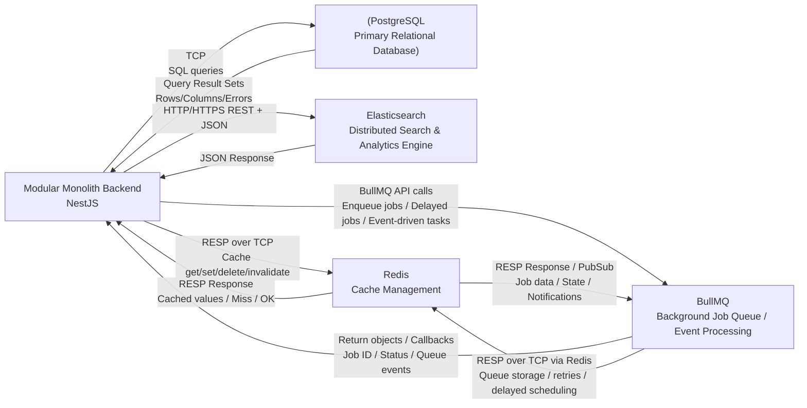

# System Architecture
---
## 1. System Context Diagram

```mermaid
flowchart LR
  Patient[Patient]
  Admin[Admin]
  MedApp[MedApp]
  Stripe["Stripe API\nPayments + Webhooks"]

  Patient -->|Auth + Create/Edit Profile\nBook Services| MedApp
  MedApp -->|Response| Patient

  Admin -->|Auth + Create/Edit Profile\nHospital Info, Packages, Services| MedApp
  MedApp -->|Response| Admin

  MedApp -->|Call Payment APIs| Stripe
  Stripe -->|Responses + Webhook Events| MedApp
```
---

## 2. Container Diagram

```mermaid
flowchart LR
  MedApp["Modular Monolith Backend\nNestJS"]
  
  PG["(PostgreSQL\nPrimary Relational Database)"]
  ES["Elasticsearch\nDistributed Search & Analytics Engine"]
  Redis["Redis\nCache Management"]
  BullMQ["BullMQ\nBackground Job Queue / Event Processing"]

  
  MedApp -->|TCP\nSQL queries| PG
  PG -->|Query Result Sets\nRows/Columns/Errors| MedApp

  MedApp -->|HTTP/HTTPS REST + JSON| ES
  ES -->|JSON Response| MedApp

  MedApp -->|RESP over TCP\nCache get/set/delete/invalidate| Redis
  Redis -->|RESP Response\nCached values / Miss / OK| MedApp

  MedApp -->|BullMQ API calls\nEnqueue jobs / Delayed jobs / Event-driven tasks| BullMQ
  BullMQ -->|Return objects / Callbacks\nJob ID / Status / Queue events| MedApp

  BullMQ -->|RESP over TCP via Redis\nQueue storage / retries / delayed scheduling| Redis
  Redis -->|RESP Response / PubSub\nJob data / State / Notifications| BullMQ
```